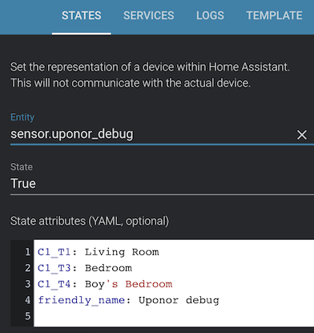

# homeassistant-uponor

[](https://www.paypal.me/asev)

Custom component for Home Assistant to connect Uponor Smatrix Pulse X-265 heating system.

## Requirements

1. Uponor Smatrix Pulse controller X-265
2. Uponor Smatrix Pulse communication module R-208

## Installation

1. Startup and configure heating system on Uponor Smatrix mobile app. Make sure your can control heating via app.
System has to be connected to local network and you should know it's IP address.

2. Copy the custom_components folder to your own Home Assistant /config folder.

OR add https://github.com/asev/homeassistant-uponor as _Custom repository_ in HACS with _Integration_ category.

3. Enable the component by adding the following in your `configuration.yml`:
```yaml
uponor:
    host: IP_ADDRESS_OF_UPONOR_DEVICE
```
4. Restart Home Assistant server
5. For every thermostat separate entity `climate.THERMOSTAT_NAME` will be created.
Thermostat names can be changed in mobile app or via configuration. 

## Configuration

- `debug` : boolean (optional) - enables custom sensor to see active thermostat ids.
Set it to true and check `sensor.uponor_debug` state attributes. It shows thermostat id and name from API.
Use same id for `names` configuration option to have custom names.



- `names` : map (optional) - custom name for every thermostat. `cX_tY` is thermostat id.

```yaml
uponor:
    host: IP_ADDRESS_OF_UPONOR_DEVICE
    names:
      C1_T1: "Blue room"
      C1_T4: "Henry's room"
```

## Limitations

Uponor API does not support turn off action. When heating is turned off on Home Assistant,
the temperature is set to minimum (by default 5℃).

## Feedback

Your feedback, pull requests or any other contribution are welcome.
